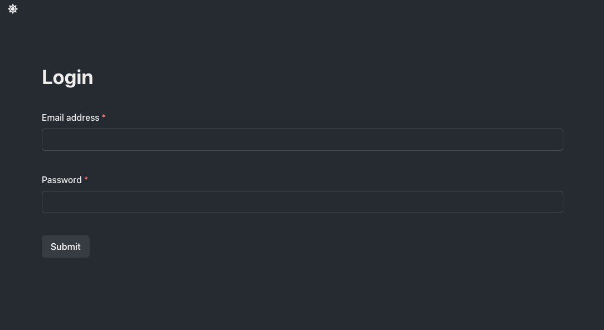

# Makers Project

## Setup API

- `cd server`
- Install dependencies `npm install`
- Start the server using `node server.js`

## Setup Client

- `cd client/my-app`
- Install dependencies `npm install`
- Start the client using `npm start`

## Stack

- MongoDB
- React
- ChakraUI
- Node.js
- Express
- Mongoose
- JWT

## Screenshots

### Homepage

### Login

### Signup

### Projects

### Project Detail

## API

### `GET` requests

`/api/projects?page=1` : Returns an object with all the projects, total pages and current page.

`/api/projects/:id` : Returns a specific project using its ID URL parameter

`/api/projects/name/:name` : Returns filtered projects by name

`/api/projects/creator:creator` : Returns filtered projects by creator

`/api/projects/date?startDate=2019-01-01&endDate=2022-01-01` : Returns all projects from a date range

`/logout` : Logs out the current user

`/api/projects/delete/:id` : Delete a specific project using its ID

### `POST` requests

`/api/projects/create` : Creates a new project from a JSON object

`/api/projects/edit/:id` : Edits a specific project using its ID

`/login` : Logs in a user from a JSON object

`/register` : Registers a users from a JSON object

> All API endpoints are working correctly and were tested with Postman, using JSON format

## Interface features

- Login
- Sign up
- View all projects
- View specific projects
- Pagination view
- Sign out
- Delete project

## Interface missing features

- Creating new projects
- Editing projects
- Filtering
